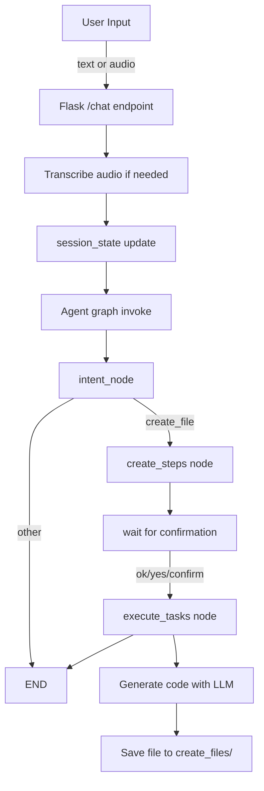

# Voice-Controlled Local AI Agent

A small voice-enabled Flask AI assistant that classifies user commands, breaks file-generation requests into task steps, and writes generated source code to a local `create_files/` directory.

## Architecture Overview

This repository is organized as a lightweight state-driven pipeline.

- `main.py` runs a Flask web server and exposes a `/chat` endpoint.
- `src/agent.py` builds a `StateGraph` workflow with 3 execution nodes.
- `src/state.py` defines the shared `AgentState` typed dictionary.
- `src/nodes/intent_node.py` detects the user's intent using a Groq-powered LLM.
- `src/nodes/create_file_node.py` generates task steps and executes file creation.
- `src/prompts/detect_intent_prompt.py` contains a structured intent prompt template.
- `templates/index.html` is the web UI page served by Flask.
- `create_files/` stores generated output files such as `generated.py` and `Generated.java`.

## High-Level Flow

1. User sends text or audio to `/chat`.
2. `main.py` converts audio to text when needed.
3. The message is passed into the compiled `StateGraph` bot.
4. `intent_node` decides whether the user wants to create a file.
5. If the intent is `create_file`, `create_steps` asks the LLM to break the request into a task list.
6. The conversation waits for user confirmation (`ok`, `yes`, `confirm`).
7. When confirmed, `execute_tasks` generates source code and saves it locally.

## Components

### `main.py`

- Launches the Flask app.
- Serves the UI at `/`.
- Handles `/chat` POST requests with either JSON text or uploaded audio.
- Uses `pydub` and `speech_recognition` to convert WebM audio into transcribed text.
- Maintains a simple `session_state` dict across requests.
- Calls the compiled agent returned by `src.agent.return_bot()`.

### `src/agent.py`

- Uses `langgraph.graph.StateGraph` to build a directed workflow.
- Registers three nodes: `intent`, `create_steps`, and `execute_tasks`.
- The router function chooses the next node based on current input and intent.
- The graph finishes after `create_steps` or `execute_tasks`.

### `src/state.py`

- Defines `AgentState` as a typed dictionary with fields like:
  - `input`
  - `intent`
  - `list_of_tasks`
  - `approved`
  - `messages`
  - `step`
- Keeps state consistent across graph nodes.

### `src/nodes/intent_node.py`

- Uses `langchain_groq.ChatGroq` and a prompt template to classify intent.
- Returns either `create_file` or `other`.
- Appends the user message to the `messages` history.
- Skips LLM classification when the user confirms an existing action.

### `src/nodes/create_file_node.py`

- `create_steps(state)`:
  - Prompts the LLM to turn a request into a list of atomic tasks.
  - Expects a JSON-style list response.
  - Saves the generated task list in state.
- `execute_tasks(state)`:
  - Reads the original request and chooses a file extension.
  - Prompts the LLM to generate only source code for the target file.
  - Writes the generated code into `create_files/<filename>`.

### `src/prompts/detect_intent_prompt.py`

- Defines a structured JSON prompt for intent classification.
- Describes supported intents, expected fields, and strict format rules.

## Running the Application

1. Install dependencies:

```bash
pip install -r requirements.txt
```

2. Create and configure environment variables:

```bash
copy .env.example .env
```

3. Set `GROQ_API_KEY` in `.env`.

4. Start the Flask server:

```bash
python main.py
```

5. Open the browser at `http://127.0.0.1:5000/`.

6. Use the web UI to type a command or upload an audio file.

## Output and Safety

- Generated files are written only to the local `create_files/` folder.
- Supported generated output filenames include:
  - `generated.py`
  - `Generated.java`
  - `Generated.cpp`
  - `generated.js`
  - `generated.ts`
  - `generated.html`
- The app avoids writing files until the user confirms the plan.

## Mermaid Architecture Diagram



## Notes

- The project currently uses the Groq API for generation and classification.
- `src/prompts/detect_intent_prompt.py` captures a richer intent schema but the current node implementation uses an inline prompt for classification.
- `templates/index.html` is the web UI entry point served by Flask.

## File Locations

- `main.py` — web server and input handling
- `src/agent.py` — state graph assembly
- `src/state.py` — typed shared state model
- `src/nodes/intent_node.py` — intent detection
- `src/nodes/create_file_node.py` — task planning and execution
- `src/prompts/detect_intent_prompt.py` — intent prompt template
- `create_files/` — generated output files
- `templates/index.html` — browser UI
